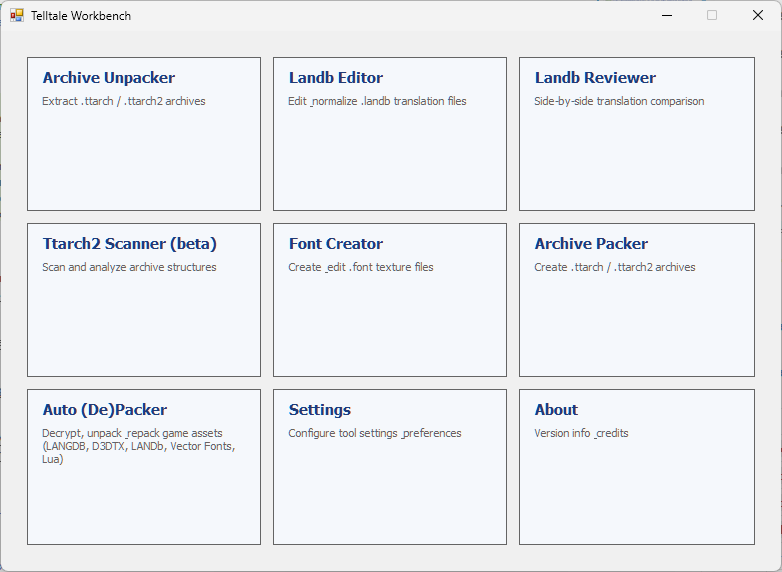
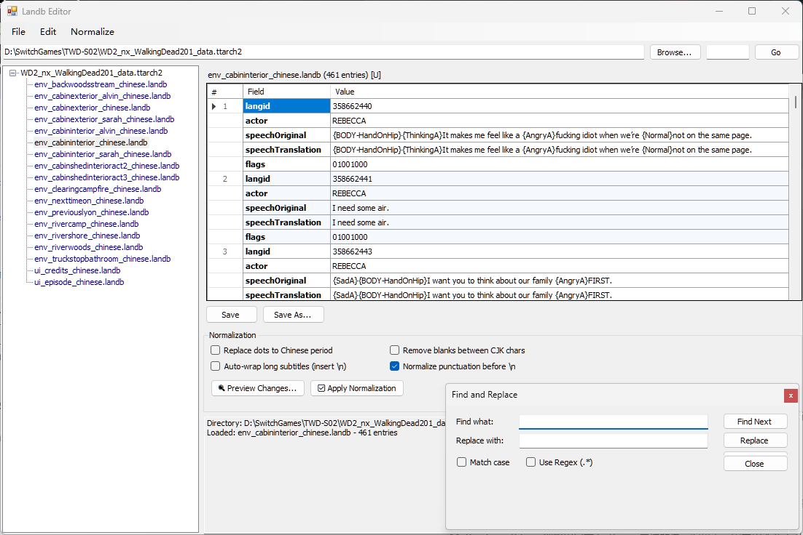
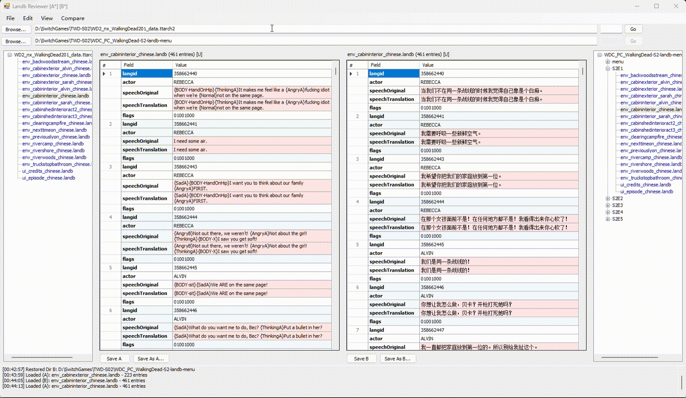

# Telltale Workbench

**Telltale Workbench** is a comprehensive toolkit for modifying Telltale Games resource files. It covers the full fan translation pipeline: unpack archives, create fonts, edit translation text, and repack into game-ready archives.

Originally forked from [TTG Tools](https://github.com/HeitorSpectre/TTG-Tools) by Den Em and Pashok6798.

## Modules

| Module | Description |
|--------|-------------|
| **Archive Unpacker** | Extract `.ttarch` / `.ttarch2` archives with auto key detection |
| **Landb Editor** | Edit & normalize `.landb` translation files with CJK text normalization |
| **Landb Reviewer** | Side-by-side translation comparison with tree navigation |
| **Ttarch2 Scanner** | Browse archive contents without full extraction |
| **Font Creator** | Create & edit `.font` files (5VSM/6VSM/ERTM) for multiple platforms |
| **Archive Packer** | Create `.ttarch` / `.ttarch2` archives with compression & encryption |
| **Auto (De)Packer** | Decrypt, unpack & repack game assets in batch |
| **Settings** | Configure tool preferences |

## Font Creator

The Font Creator handles Telltale's `.font` binary format (5VSM/6VSM/ERTM), which stores glyph textures, character metrics, and layout parameters. It supports:

- **BMFont → .font conversion**: Import `.fnt` files and DDS textures with automatic platform detection and swizzle settings
- **Texture pipeline**: Multi-page DDS (BC3/DXT5), platform-specific texture headers, Nintendo Switch hardware layout block injection
- **Character metrics**: Per-glyph X/Y offsets, advance widths, UV coordinates with batch adjustment
- **CJK support**: Full UTF-8 encoding for FontName and ObjectName
- **Create fonts from scratch**: `New → Import FNT → Import DDS → Save` pipeline
- **Platform swizzle**: Nintendo Switch, PS4, PS Vita, Xbox 360, Wii

## Compression

Telltale Workbench supports multiple compression algorithms for archive packing and unpacking:

- **Oodle Kraken** (0x8C 0x06) — detection and decompression in Archive Unpacker; compression in Archive Packer with buffer overflow protection
- **Oodle LZHLW** (0x8C 0x05) — full compress/decompress support
- **Zlib / Deflate** — standard compression used by most Telltale archives
- **Last Chunk Padding** — configurable in Archive Packer: padded mode for compatibility, unpadded for smaller archives. Unpacker auto-detects padding status and displays it in the Archive Info panel.

## Supported Games

Telltale Texas Hold'em, Bone (Out from Boneville / The Great Cow Race), Sam & Max (Save the World / Beyond Time and Space / The Devil's Playhouse + Remastered), Strong Bad's Cool Game for Attractive People, Wallace & Gromit's Grand Adventures, Tales of Monkey Island, Hector: Badge of Carnage, Puzzle Agent 1 & 2, Poker Night at the Inventory / Poker Night 2 (+ Remastered), Back to the Future: The Game, Jurassic Park: The Game, Law & Order: Legacies, CSI (3D, Hard Evidence, Deadly Intent, Fatal Conspiracy), The Walking Dead (S1-S4, Michonne, Definitive Series), The Walking Dead Nintendo Switch(S1-S4), The Wolf Among Us, Tales from the Borderlands, Game of Thrones, Minecraft: Story Mode (S1 & S2), Batman (S1 & S2), Guardians of the Galaxy.

## Screenshots
### Main UI

### Landb Editor

### Landb Reviewer

### Archive Unpacker

### Archive Packer

### Auto (De)Packer
Packer.png)

### Font Creator

## Special Thanks

- Den Em and Pashok6798 for the original TTG Tools
- Aluigi for `ttarchext`
- Taylor Hornby for the C# Blowfish implementation
- Gdkchan, Stella/AboodXD for Nintendo Switch swizzle
- Daemon1 and tge for PS4 swizzle
- Josh Tamely for the Oodle wrapper
- Hajin Jang for the Zlib wrapper
- [Nemiroff](https://github.com/Nemiroff/TTG-Tools) for Font Editor bug fixes
- Krisp for Xbox/Wii texture support and font editing with Swizzle
- [Benny](https://quickandeasysoftware.net) for the Poker Night Remastered encryption key
